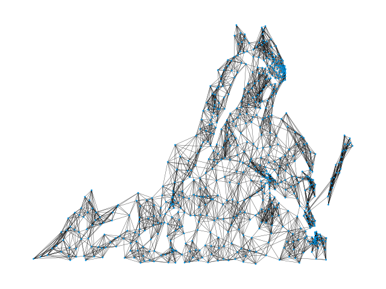
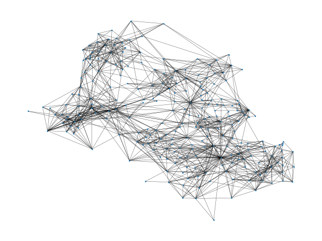

# Geosocial Network Location Estimation
This is the code for the forthcoming paper *Your Friends Reveal Where You Are: Location Estimation based on Friends’ Locations in Geosocial Networks*.

## Abstract
Geosocial networks serve as a critical bridge between cyber and physical worlds by linking individuals to locations. In many real-world scenarios, both the structure of social networks and the spatial distribution of places are known—yet the connecting information that links people to locations is missing. This absence is often intentional to ensure user privacy. In this work, we investigate the feasibility of estimating locations based solely on network structure and a limited set of known user-location pairs.
We propose and evaluate four algorithms for linking social and spatial networks: (i) a greedy assignment algorithm, (ii) a hierarchical approach using graph partitioning, (iii) a spatially-aware adaptation of force-directed graph drawing, and (iv) a modified version of Spatial Label Propagation. Each method is further enhanced to incorporate a small number of known anchor vertex—users with known locations. Using anonymized social network data from the Virginia, USA region, our empirical evaluation shows that even a sparse set of anchor points can enable accurate estimation of users' home locations. These findings highlight both the potential analytical value and the privacy risks associated with linking social and spatial data.

## Algorithms
The four proposed algorithms are included in this repository:
1. The Greedy algorithm. This algorithm matches vertices to locations that are close to the locations of vertices they are connected to. Vertices are processed iteratively in order of degree.
2. The Partitioning-Based algorithm. This algorithm utilizes METIS, a graph partitioning software, to match clusters of vertices to clusters of locations.
3. The Graph Drawing algorithm. This algorithm utilizes the NetworkX Spring Layout function to generate locations for each vertex in the social network. There are two versions of this algorithm to match vertices from generated to actual locations: one where vertices are matched to locations in order of highest degree (labeled as greedy), and one where vertices are matched using a modified Jonker-Volgenant algorithm (labeled as optimal).
4. Spatial Label Propagation. This algorithm uses the Spatial Lable Propagation, outlined in [[1]](#1). This algorithm is modifed so that new locations that are generated continously are mapped to the set of known locations using the two versions described for the Graph Drawing Algorithm: greedy and optimal.

Requirements for each algorthim:
* An adjacency matrix to represent the social network
* A list of coordinates that vertices are matched to
* A dictionary of known locations that maps the ID of a vertex in the adjacency matrix to a coordinate in the list of locations. If there are no known locations, this dictionary is empty.

Each algorithm returns a dictionary that maps vertices to locations.

## Experimental Results
| Ground Truth Network for Facebook Location Data| Ground Truth Network for Fairfax Mobility Data|
|:-:|:-:|

The three proposed algorithms were tested on three datasets: Facebook Social Connectedness Data [[2]](#2), Fairfax Mobility Data [[3]](#3), and a Synthetic Geosocial Erdős-Rényi Network [[4]](#4). The social networks and locations for the first two datasets were generated using the code in the folder Datasets. For the Synthetic Geosocial Erdős-Rényi Network, random locations were used and the social network was generated using the code in the [Synthetic Geosocial Networks Repository](https://github.com/KetevanGallagher/Synthetic-Geosocial-Networks). The Ground Truth Networks for the Facebook and Fairfax data are shown in the figure above.

Detailed quantitative results, including the average distance between the assigned location and true location, the number of nodes inferred correctly, run time, and the standard deviations of average distances can be found under [ExperimentalResults](ExperimentalResults). These quantitative results are the average of 30 trials. The standard deviations displayed are calculated from the 30 trials.

## References
<a id="1">[1]</a> 
D. Jurgens, “That’s What Friends Are For: Inferring Location in Online Social Media Platforms Based on Social Relationships”, ICWSM, vol. 7, no. 1, pp. 273-282, Aug. 2021.

<a id="2">[2]</a> 
M. Bailey, R. Cao, T. Kuchler, J. Stroebel, and A. Wong. Social connectedness: Measurement, determinants, and effects. *Journal of Economic Perspectives*, 32(3):259–280, 2018.

<a id="3">[3]</a> 
Y. Kang, S. Gao, Y. Liang, M. Li, J. Rao, and J. Kruse. Multiscale dynamic human mobility flow dataset in the us during the covid-19 epidemic. *Scientific data*, 7(1):390, 2020.

<a id="4">[4]</a> 
K. Gallagher, T. Anderson, A. Crooks, and A. Züfle. Synthetic geosocial network generation. In *Proceedings of the 7th ACM SIGSPATIAL Workshop on Location-based Recommendations, Geosocial Networks and Geoadvertising*, pages 15–24, 2023.
